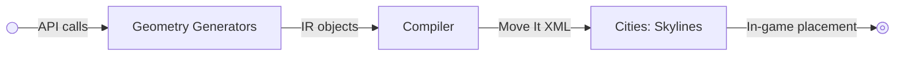

# Scalable City Language

SCL (Scalable City Language) is a geometry toolkit for Cities: Skylines that enables algorithmic generation of city infrastructure.

Instead of manually placing roads and objects with the mouse, SCL allows layouts to be defined using code, math, and parametric geometry, then compiled into formats the game can import.

The first target is Move It selection XML, allowing generated infrastructure to be pasted directly into a city.

SCL is conceptually similar to how SVG describes vector graphics or how OpenSCAD describes CAD geometry.

## Motivation

Building precise infrastructure in Cities: Skylines can be difficult even with advanced mods. Tasks such as:

- perfect spirals
- smooth highway ramps
- mathematically correct curves
- large parametric layouts
- reproducible infrastructure

are hard to achieve with interactive tools.

SCL provides a way to define these layouts algorithmically.

Instead of: move mouse &rarr; place road &rarr; adjust &rarr; retry

SCL allows: define geometry &rarr; generate layout &rarr; paste into game

Complete flow:



This enables:

- exact coordinates
- exact angles
- parametric infrastructure
- reproducible layouts
- version control of city geometry

## Philosophy

SCL is neither a game mod or a full programming language.

It is a geometry library and compilation pipeline.

SCL focuses on three responsibilities:

1. Generate infrastructure geometry
2. Represent it in a simple intermediate model
3. Compile it to formats the game understands

## Intermediate Representation

The core IR mirrors the Cities: Skylines network model.

Only two primitives are required: Node and Segment

Everything else is derived from these.

## Node

Represents a network node or intersection.

```ts
interface Node {
  id: number
  position: Vec2
  prefab: string
  flags: NodeFlags
}
```

Example:

```text
Node
  id: 0x05000001
  position: (-218.897, -464.214)
  prefab: "Gravel Road"
```

## Segment

Represents a road between two nodes.

```ts
interface Segment {
  id: number
  startNode: Node
  endNode: Node
  startDirection: Vec2
  endDirection: Vec2
  midpoint: Vec2
  prefab: string
}
```

Segments use the same spline parameters as the game engine.

## Geometry Generators

Generators produce nodes and segments programmatically.

Examples:

```text
spiral(...)
arc(...)
polyline(...)
grid(...)
roundabout(...)
```

Generators return infrastructure geometry in IR form.

Example:

```text
spiral(
  center = (0,0),
  pitch = 82,
  turns = 40
)
```

## Compiler Targets

The first compiler target is Move It selection XML.

The resulting file can be pasted directly into the game using Move It.

Future targets may include:

- direct mod integration
- Cities Skylines 2 APIs
- visualization formats

## Move It Format

SCL compiles infrastructure geometry into Move It selections.

Example output:

```xml
<Selection xmlns:xsi="http://www.w3.org/2001/XMLSchema-instance">
  <center>
    <x>-179.109116</x>
    <z>-468.32666</z>
  </center>
  <state xsi:type="NodeState">
    ...
  </state>
  <state xsi:type="SegmentState">
    ...
  </state>
</Selection>
```

The Move It format describes:

- nodes
- segments
- object relationships
- spline geometry

SCL handles all required serialization details.

## Example Workflow

Example pipeline:

```sh
scl generate spiral \
  --pitch 82 \
  --turns 40 \
  > spiral.xml
```

Then in Cities: Skylines:

1. Copy the XML
2. Paste using Move It
3. The generated layout appears in-game

## Visualization

Because SCL geometry is deterministic, layouts can be previewed before importing.

Possible visualizations include:

- browser canvas
- SVG rendering
- WebGL preview

Future versions may include an interactive browser playground.

## Why "Scalable"

SCL is scalable in two ways.

### Geometry scaling

Layouts can be resized by adjusting parameters.

Example:

```text
spiral(radius=20)
spiral(radius=200)
```

Same layout, different scale.

### Development scaling

Because infrastructure is defined as text:

- version control
- scripting
- parametric generation
- reproducible builds

all become possible.

## Example Use Cases

SCL enables layouts that are difficult to build manually.

Examples:

- spiral suburbs
- highway interchanges
- turbine interchanges
- smooth ramp transitions
- parametric roundabouts
- procedural city layouts

## Roadmap

Planned components:

- core geometry library
- Move It XML compiler
- command line interface
- browser playground
- visualization tools
- optional in-game mod integration

## Status

SCL is currently experimental.

The Move It format has been reverse-engineered sufficiently to allow generation of valid infrastructure layouts.

The project is focused on building the first geometry generator and compiler pipeline.
